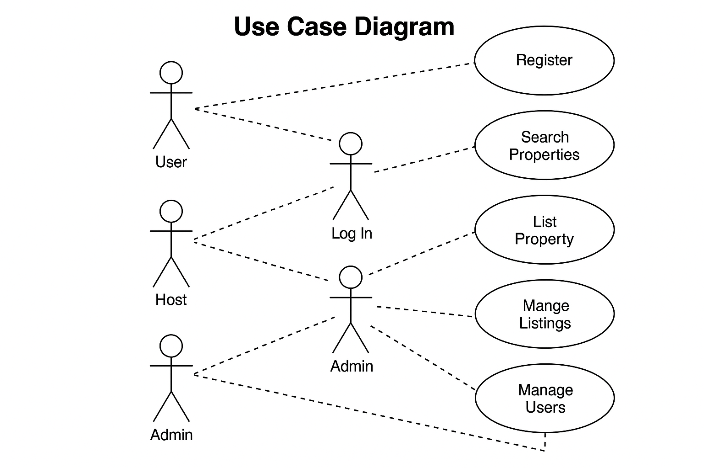

## Requirement-Analysis

# Requirement Analysis in Software Development
Introduction
This repository serves as the foundational step in analyzing and documenting the requirements for a software development project. It is part of the FeatureForge: Crafting Your Project Blueprint course and focuses on simulating real-world requirement analysis for a booking management system.

The goal is to enhance understanding of the software development lifecycle (SDLC) by mastering the principles of requirement elicitation, documentation, validation, and visualization. Through a structured and practical approach, this project emphasizes the importance of clarity and precision in capturing both functional and non-functional requirements, setting the stage for successful project execution.

# What is Requirement Analysis?
Requirement Analysis is a critical phase in the Software Development Life Cycle (SDLC) that involves identifying, gathering, analyzing, and documenting the needs and expectations of stakeholders for a software system. It serves as the foundation upon which the entire development process is built, ensuring that the final product aligns with user needs and business goals.

Importance in the SDLC
Requirement Analysis plays a pivotal role in the success of any software project. Its importance can be summarized as follows:

Defines the Project Scope: By clearly outlining what the system should do and what it should not do, it helps prevent scope creep and sets realistic expectations for all stakeholders.

Improves Communication: It bridges the gap between stakeholders (e.g., clients, end-users) and the development team by translating business needs into technical language.

Reduces Risks and Errors: By identifying requirements early, it minimizes the chances of costly revisions later in the project lifecycle.

Guides Design and Development: It provides a blueprint that guides system architecture, user interface design, and functionality implementation.

Supports Testing and Validation: Well-defined requirements help create effective test cases to verify that the system meets its intended purpose.

Ensures Stakeholder Satisfaction: Ultimately, it ensures that the delivered software meets or exceeds stakeholder expectations.

In summary, Requirement Analysis is the cornerstone of successful software development. Without it, teams risk building systems that are misaligned with user needs, over budget, or delivered late.

# Why is Requirement Analysis Important?
Requirement Analysis is one of the most vital steps in the software development lifecycle (SDLC). It lays the groundwork for building a system that is aligned with business objectives and user expectations. Below are three key reasons why this phase is critical:

1. Prevents Miscommunication and Misalignment
Requirement Analysis ensures that all stakeholders — including clients, users, and the development team — have a shared understanding of what the system is supposed to do. By documenting needs clearly and unambiguously, it eliminates confusion and aligns everyone toward a common goal.

2. Reduces Cost and Time Overruns
By identifying and validating requirements early in the development process, teams can avoid costly revisions, feature rework, or project delays. A well-defined set of requirements acts as a reference point that helps keep development on track and within budget.

3. Enhances Software Quality and User Satisfaction
Clear and detailed requirements help developers build features that genuinely address user needs. They also provide a benchmark for testing and validation, ensuring the final product functions as intended and meets performance expectations, resulting in higher satisfaction among users and stakeholders.

# Key Activities in Requirement Analysis
Requirement Analysis involves a series of structured activities that help ensure the software product meets stakeholder expectations and business goals. The five key activities are:

 ** Requirement Gathering:
  
This involves collecting information from stakeholders, end-users, and subject matter experts to understand what they expect from the system. Techniques include interviews, questionnaires, observation, and reviewing existing documentation.

 ** Requirement Elicitation:
  
This is the process of refining and uncovering stakeholder needs through interactive methods such as brainstorming sessions, prototyping, and use case analysis. It helps clarify vague or hidden requirements that may not surface during initial discussions.

 ** Requirement Documentation:
  
Once gathered and elicited, requirements are formally documented in structured formats like Software Requirement Specification (SRS) documents, user stories, or requirement lists. This step ensures consistency, traceability, and a reference for future phases of the project.

 ** Requirement Analysis and Modeling:
  
In this phase, requirements are examined for completeness, feasibility, and clarity. Modeling tools such as use case diagrams, data flow diagrams (DFD), and Entity-Relationship Diagrams (ERD) are often used to visualize system behavior and interactions.

 ** Requirement Validation:
  
This final activity involves reviewing and validating the documented requirements with stakeholders to confirm they accurately reflect user needs and expectations. It helps identify any ambiguities, conflicts, or gaps before development begins.

## Types of Requirements
  In software development, requirements are typically categorized into two main types: Functional Requirements and Non-functional Requirements. Understanding both is essential to ensure the system performs correctly and efficiently.

Functional Requirements
Definition:
  Functional requirements define what the system should do — the specific features, behaviors, and functions it must perform to meet the needs of users and stakeholders.

Examples for Booking Management System:

  *  Users must be able to register and log in securely to their accounts.

  *  The system should allow users to search for available properties based on date, location, and type.

  *  Hosts should be able to list new properties with details like pricing, availability, and photos.

  *  Users must be able to make bookings and receive email confirmations.

  *  Admins should be able to manage user accounts, property listings, and booking records.

Non-functional Requirements
Definition:
Non-functional requirements describe how the system should perform. They cover attributes like performance, usability, security, and scalability that impact user experience and system quality.

Examples for Booking Management System:

  *  The system should load property search results within 2 seconds.

  *  User data must be encrypted and stored securely following data protection regulations.

  *  The application should support up to 10,000 concurrent users without performance degradation.

  *  The interface should be mobile-responsive and accessible to users with disabilities.

  *  The system should be available 99.9% of the time, ensuring high reliability.

## Use Case Diagrams
Use Case Diagrams are visual representations used in Requirement Analysis to describe the functional interactions between users (actors) and the system. Each diagram outlines different ways a user might interact with the application, helping teams understand system behavior from the user's perspective.

Benefits of Use Case Diagrams:
  *  Clarify System Scope: Helps identify what the system should and should not do.

  *  Enhance Communication: Bridges understanding between technical and non-technical stakeholders.

  *  Identify Actors and Interactions: Clearly maps out users and their goals.

  *  Facilitate Test Planning: Supports the creation of user-centric test cases.

Use Case Diagram for Booking Management System
Below is the use case diagram for the booking system, showing the main actors and their interactions with the system:

Main Actors and Use Cases:
  *  Guest

    *  Register / Log In
    *  Search Properties
    *  Book Property
    *  View Booking History

  *  Host

    *  Log In
    *  List Property
    *  Manage Listings
    *  View Bookings

  *  Admin

    *  Manage Users
    *  Manage Properties
    *  Generate Reports

## Use Case Diagram

Below is the use case diagram illustrating the main actors and their interactions with the booking system:

